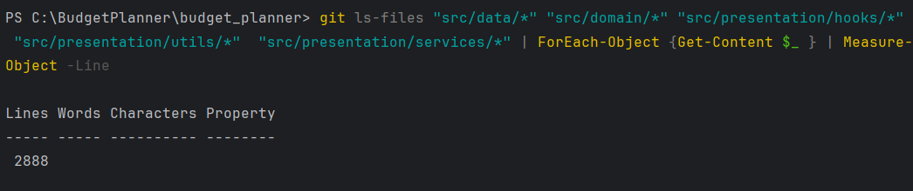

# 📱 Financial Planner App

A simple and flexible React Native application (based on Expo) for managing personal finances - accounts, categories,
and transactions - with customizable themes and currency support.

---

## Getting Started

To launch the app locally, follow these steps:

1. **Install dependencies** using npm:

   ```bash
   npm install
   ```

2. **Run the application**:

   ```bash
   npx expo run
   ```

   After running the command, you will be prompted to open the app on your device using:

    * **Expo Go** (scan the QR code), or
    * a simulator/emulator (e.g., Android Studio or Xcode)

---

## Features Overview

### 1. Account Management

Manage your financial accounts with support for different currencies and goal tracking.


**Creating a new account:**


---

### 2. Category Management

Categories are organized in a **tree structure**, allowing you to create an unlimited number of nested subcategories.


**Creating a new category:**


---

### 3. Transactions

Create and manage transactions between accounts or within categories. Supports income, expense and transfer types.


---

### 4. Settings

Customize the app to your needs:

* Switch between light and dark themes:


* Set a base currency, used for displaying converted amounts throughout the app:


---

## Requirements

* Node.js ≥ 18

* npm (or yarn)

* Expo CLI (optional):

  ```bash
  npm install -g expo-cli
  ```

* Optional: Android Studio or Xcode for using simulators

---

## Design Patterns & Architecture

This project follows a modular and scalable structure. The following design patterns were used:

### 1. Singleton

**Singleton** - Used to ensure that `SQLiteService` exists as a single shared instance throughout the entire
application. This prevents multiple database connections and guarantees consistent data access.

_Implementation example: [`/src/data/sqlite/SQLiteService.ts`](/src/data/sqlite/SQLiteService.ts)_

### 2. Factory

**Factory Pattern** - Implemented as `RepositoryFactory` to dynamically create and return appropriate repository
instances (e.g., for `Category`, `Account`, `Transaction`, etc.). This encapsulates object creation logic, decouples
the client from concrete implementations, and adds caching for reuse.

_Implementation
example: [`/src/data/repositories/RepositoryFactory.ts`](./src/data/repositories/RepositoryFactory.ts)_

### 3. Builder

**Builder Pattern + Fluent Interface** - Used in the custom `QueryBuilder` to construct SQL queries step-by-step in a
readable and chainable way. This design improves code clarity and flexibility when building complex SQL statements
without hardcoding strings.

    - The **Builder Pattern** allows progressive query construction (`select(...)`, `where(...)`, `orderBy(...)`).
    - The **Fluent Interface** enables method chaining with an intuitive and expressive syntax.

_Implementation folder: [`/src/data/builders`](./src/data/builders)_

### 4. Chain of Responsibility

**Chain of Responsibility Pattern** - Used to build a flexible and extendable currency-fetching pipeline
via `ChainCurrencyService`. Each handler in the chain performs a specific task (e.g., fetching from API, adding
fallback currencies) and passes the result to the next handler.

_Implementation folder: [`/src/data/services/currency`](./src/data/services/currency)_

Components:

- `ChainCurrencyService` - entry point to start the handler chain
- `NbuCurrencyHandler` - fetches exchange rates from the NBU API
- `AddUahCurrencyHandler` - ensures UAH is always included in the result
- `BaseCurrencyHandler` - abstract base that handles chaining logic

---

## Design Principles

This project follows several core software engineering principles to ensure code maintainability, scalability, and
readability. There is few of them:

### DRY - *Don't Repeat Yourself*

- Shared logic is abstracted into services (`SQLiteService`, `CurrencyService`) and reusable helpers (
  e.g., `QueryBuilder`, repository layer).
- The use of `BaseCurrencyHandler`, `RepositoryFactory`, and `TransactionMapper` eliminates code duplication across
  features.

### SRP - *Single Responsibility Principle*

- Each class or module has a single, well-defined purpose:
    - `AddUahCurrencyHandler` only adds a fallback currency
    - `TransactionRepository` is responsible only for transaction-related data logic
    - `QueryBuilder` only builds SQL queries, it doesn't execute them

### OCP - *Open/Closed Principle*

- The system is **open for extension**, but **closed for modification**:
    - New currency handlers can be added without touching existing ones
    - `RepositoryFactory` can support new entities by adding mappings without changing its usage
    - New SQL operators or query types can be added to the builder without altering core syntax

### DIP - *Dependency Inversion Principle*

- High-level modules (e.g., `CurrencyService`) depend on abstractions (`ICurrencyHandler`), not on concrete
  implementations.
- This promotes loose coupling and testability — e.g., you can swap `NbuCurrencyHandler` with a mock in tests.

### ISP - *Interface Segregation Principle*

- Interfaces such as `ICurrencyHandler`, `IRepository<T>`, and `ISQLiteService` are narrowly focused, making them easier
  to implement and test.
- Classes only implement what they need - avoiding “fat interfaces”.

---

## Refactoring Techniques

To improve code clarity, structure, and maintainability, the following proven refactoring techniques were applied during
development:

1. **Replace Nested Conditional with Guard Clauses**  
   Deeply nested `if-else` logic was rewritten using early return statements. This flattens the control flow, improves
   readability, and makes edge cases more visible.

   > Applied in transaction services, validation flows, and builder logic.

2. **Introduce Foreign Method**  
   Utility functions like `getTimestamp` and `calculateBalanceFromTransactions` were added to operate on external
   classes without modifying their internal implementation. These “foreign methods” live close to the services where
   they're used (e.g., `TransactionService`) and provide focused domain logic.

   Example:
    - `getTimestamp(date, time)` - converts transaction fields into a unified timestamp
    - `calculateBalanceFromTransactions(...)` - computes delta balances across snapshots

   _Used in:_ [`TransactionService`](./src/domain/services/TransactionService.ts)

   > Improves cohesion and keeps business logic centralized in relevant services, without bloating data models.
3. **Extract Class / Extract Interface**  
   Interfaces like `ICurrencyHandler`, `ISQLiteService`, and `IRepository<T>` were introduced to isolate
   responsibilities and allow clean abstraction of services and logic layers.

   > Enhances testability, flexibility, and supports dependency injection.

4. **Replace Constructor with Factory Method**  
   Instead of directly instantiating repositories or services, factory methods (e.g., `RepositoryFactory`) were used to
   control object creation and reduce tight coupling.

   > Enables lazy loading, caching, and better management of lifecycle dependencies.

5. **Simplifying Method Calls**  
   Long and complex method signatures were simplified by:
    - Passing whole objects instead of individual fields
    - Creating helper wrappers to hide configuration details
    - Reducing parameter count and unifying method names

   > Leads to more readable code and cleaner service boundaries.

---

